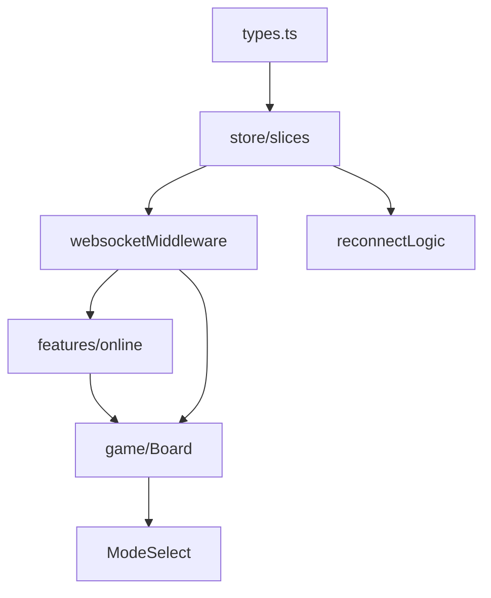

根据架构设计方案，我为你制定以下研发计划，包含模块依赖顺序及开发阶段划分：

### 阶段一：基础框架搭建 (3-5天)

```markdown
1. 类型系统构建

   - ✅ 完成 `types.ts` 全局类型定义
   - ✅ 配置严格 TypeScript 编译选项

2. 核心状态管理 (store/)

   - ✅ 实现基础 store 结构
   - ✅ 完成 gameSlice.ts 核心逻辑（棋盘同步机制）
   - ✅ 开发 networkSlice.ts 网络状态管理
   - ➡️ 房间功能暂用 Mock 数据

3. WebSocket 中间件
   - ✅ 完成事件分发系统
   - ✅ 集成类型校验守卫
```

### 阶段二：联机功能核心链路 (5-7天)

```markdown
1. 房间系统开发 (features/online/)

   - ✅ RoomFormModal 房间创建/加入表单
   - ✅ 对接 roomSlice.ts 状态管理
   - ✅ 实现 WS 服务器交互验证

2. 游戏主战场 (game/)

   - ✅ 升级 Board.tsx 支持联机模式
   - ✅ 封装 GamePage.tsx 双模式切换能力
   - ✅ 集成序列号同步校验机制

3. 协议开发
   - ✅ 实现 ROOM_UPDATE 消息处理
   - ✅ 完成 SYNC 消息类型双向同步
```

### 阶段三：体验优化阶段 (3-4天)

```markdown
1. 重连机制增强

   - ✅ 开发 ReconnectModal.tsx 重连弹窗
   - ✅ 完善 networkSlice.ts 的断线检测
   - ✅ WebSocket 心跳机制

2. 模式选择集成 (game/ModeSelect.tsx)

   - ✅ 单机模式快速开始
   - ✅ 联机入口跳转

3. 联动调试
   - ✅ 创建房间 => 开始对战完整流程
   - ✅ 异常流程测试（断网/挤号等场景）
```

### 阶段四：安全加固与交付 (2-3天)

```markdown
1. 类型保护增强

   - ✅ 核心组件的 memo 优化
   - ✅ 完善类型守卫函数

2. 工程化收尾
   - ✅ 全局类型导出检查
   - ✅ 禁用 any 类型扫描
   - ✅ Storybook 可视化测试
```

### 关键依赖路径



### 研发策略建议

1. **并行开发**：类型系统与 store 开发同步进行，确保后续组件构建时有可用状态管理
2. **协议优先**：先定义清楚前端的所有 WS 消息体，生成 `.d.ts` 供联调使用
3. **Mock 策略**：
   ```typescript
   // 可用于前期开发阶段
   export const mockRoomState: RoomState = {
     players: [{ id: "bot_1", name: "AI", role: "guest", ready: true }],
     status: "waiting",
     roomCode: "TEST",
   };
   ```
4. **组件驱动**：
   - 优先保证 GamePage → Board 的最小可玩性
   - 联机功能开发时保留单机模式快速入口

需特别注意 `RoomFormModal` 与 `websocketMiddleware` 的联调时序，建议在建立 WS 连接前实现状态预校验逻辑：

```typescript
// RoomFormModal.tsx 的提交处理逻辑
const handleCreate = () => {
  if (!navigator.onLine) {
    dispatch(setNetworkStatus("offline"));
    return;
  }
  onCreateRoom(formValues);
};
```
