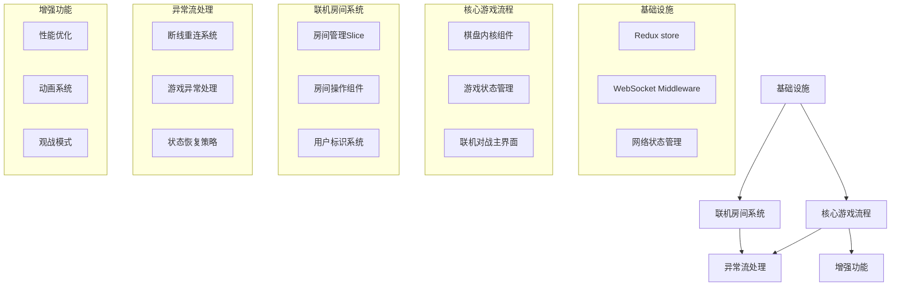

根据架构设计和组件依赖关系，以下是推荐的开发顺序策略和核心路径规划：

### 一、依赖关系分析



### 二、推荐开发顺序

#### 阶段1：基础设施搭建（2-3天）

```
1. Redux store基础配置
   - 完成rootReducer组合
   - 配置websocketMiddleware
   - 基础类型定义（types/wsMessage.ts）

2. 网络层基础设施
   - 实现WebSocket连接管理器（services/websocket.ts）
   - 完成心跳检测机制
   - 网络状态Slice开发（features/network/）

3. 公共能力模块
   - 棋盘工具类（boardUtils.ts）
   - WebSocket自定义Hook骨架（useWebSocket.ts）
```

#### 阶段2：核心游戏流程（5-7天）

```
1. 棋盘内核组件
   - BoardGrid组件（纯UI渲染）
   - Stone落子动画组件
   - 胜负判定算法（checkWin.ts）

2. 游戏状态管理
   - gameSlice完整实现
   - 棋盘数据同步Thunks（syncThunks.ts）
   - 落子操作与状态更新联动

3. 联机对战主界面
   - OnlineBoard容器组件
   - 实现props与redux-store的连接
   - Action与WS消息的转换处理
```

#### 阶段3：联机房间系统（3-5天）

```
1. 房间管理Slice
   - roomSlice状态定义
   - 房间列表更新机制

2. 房间操作组件
   - CreateRoomForm表单逻辑
   - RoomList动态渲染
   - JoinRoom表单验证

3. 用户标识系统
   - 用户临时ID生成（cookies/localStorage）
   - userSlice基础功能
```

#### 阶段4：异常流处理（2-3天）

```
1. 断线重连系统
   - 重试策略管理（reconnectManager.ts）
   - 离线状态检测Hook（useReconnect.ts）
   - ReconnectModal视觉反馈

2. 游戏异常处理
   - UndoRequestDialog协商机制
   - 超时自动投降逻辑
   - 非法操作拦截系统
```

#### 阶段5：增强功能（穿插进行）

```
1. 性能优化（棋盘memoization、AI worker）
2. 动画增强系统（落子涟漪、胜利高亮）
3. 观战模式支持
```

### 三、关键路径说明

1. **WebSocket与Redux联动**（高优先级）

```typescript
// 示例代码：消息类型安全处理
const handleMessage = (msg: WSMessage, store: Store) => {
  if (isGameStartMessage(msg)) {
    store.dispatch(gameStart(msg.players));
    store.dispatch(navigate("/game")); // 路由跳转
  }
};
```

2. **棋盘数据流优化**（性能关键）

```text
操作流程：
用户点击 -> 验证合法 -> WS发送 -> 乐观更新 -> 确认广播 -> Redux更新 -> 渲染优化
```

```typescript
// 使用CSS transform代替位置重排
const Stone = memo(({ x, y }: Position) => (
  <div
    className="stone"
    style={{
      transform: `translate(${x * 100}%, ${y * 100}%)`,
      transition: 'transform 0.2s ease-out'
    }}
  />
))
```

3. **重连恢复策略**（鲁棒性保障）

```javascript
// 重连处理流程
检测断线 -> 展示Modal -> 启动计时器 ->
  尝试重连 -> 成功: 请求全量状态 / 失败: 退回大厅
```

### 四、开发建议

1. **状态隔离策略**：建议按照功能切片进行分组开发（棋盘组、联机组、网络组）

2. **UI先行开发**：

```bash
# 使用Storybook启动组件驱动开发
npm run storybook
```

```typescript
// Board.stories.tsx 示例
export const DefaultBoard = () => (
  <BoardGrid size={15}>
    <Stone x={7} y={7} color="black" />
  </BoardGrid>
)
```

3. **调试工具链配置**：

```javascript
// 推荐在store中使用Redux DevTools增强
const store = configureStore({
  middleware: [websocketMiddleware, logger],
  devTools: process.env.NODE_ENV !== "production",
});
```

建议采用里程碑式开发模式，每完成一个阶段立即进行集成测试，确保消息流与状态变更的正确性，尤其关注棋盘操作与WebSocket消息之间的时序处理。
