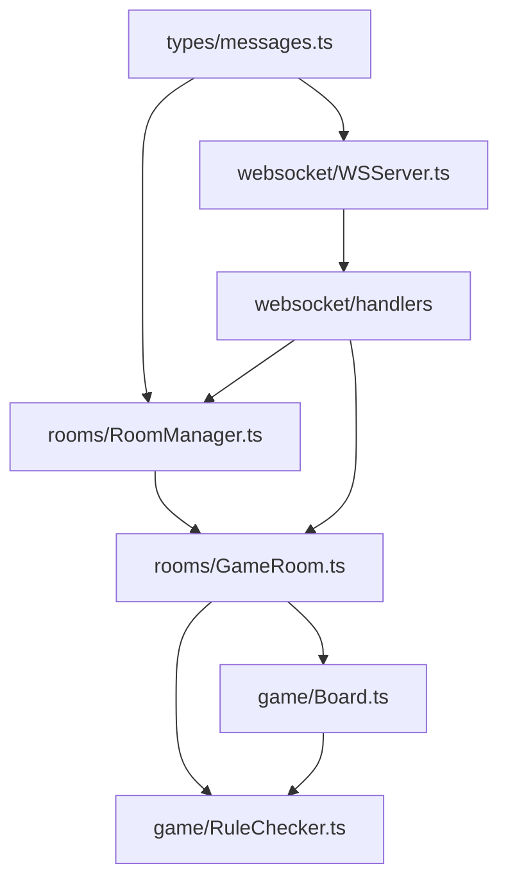
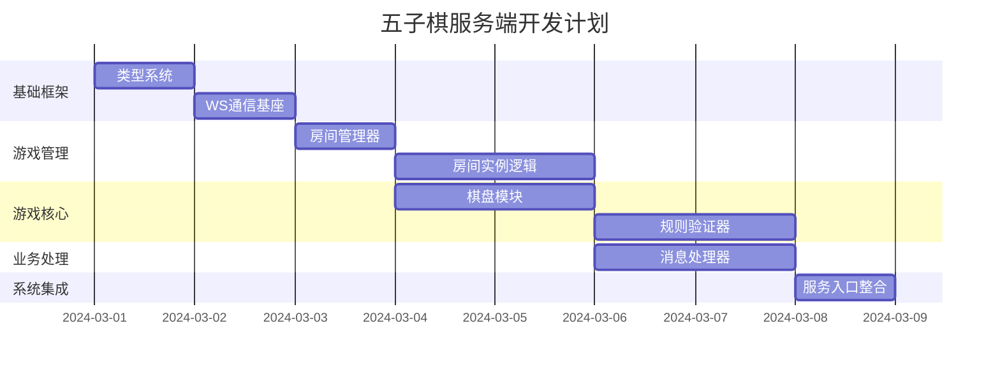

根据现有设计文档，以下是文件依赖关系、开发顺序和计划的详细整理：

---

### 一、文件依赖关系图谱



---

### 二、核心模块开发顺序

#### 第一梯队：基础架构层

1. **types/messages.ts** (类型定义)

   - 开发耗时：0.5天
   - 关键内容：
     ```typescript
     type ClientMessage = CreateRoomMessage | JoinRoomMessage | PlaceStoneMessage...
     type ServerMessage = WelcomeMessage | RoomCreatedMessage | GameStartMessage...
     ```

2. **websocket/WSServer.ts** (通信基座)
   - 开发耗时：1天
   - 里程碑：
     ```typescript
     // 完成消息分发框架
     this.wss.on("connection", (ws) => {
       ws.on("message", this.messageRouter);
     });
     ```

#### 第二梯队：游戏管理模块

3. **rooms/RoomManager.ts** (房间管家)

   - 开发耗时：1天
   - 核心方法：
     ```typescript
     createRoom(playerId) -> GameRoom
     findRoom(roomId) -> GameRoom | null
     ```

4. **rooms/GameRoom.ts** (游戏沙盒)
   - 开发耗时：2天
   - 关键职责：
     ```typescript
     class GameRoom {
       handleJoin();
       handleMove();
       broadcastState();
     }
     ```

#### 第三梯队：游戏核心逻辑

5. **game/Board.ts** (棋盘实体)

   - 开发耗时：1.5天
   - 核心能力：
     ```typescript
     placeStone(x: number, y: number, player: Player)
     getBoardState() => number[][]
     ```

6. **game/RuleChecker.ts** (胜负裁决)
   - 开发耗时：2天
   - 算法要点：
     ```typescript
     checkWinCondition(lastMove: Coord) => WinResult
     ```

#### 第四梯队：业务处理器

7. **websocket/handlers/**
   - 开发耗时：2天
   - 关键处理器：
     ```typescript
     createRoomHandler(); // 房间创建
     joinRoomHandler(); // 加入房间
     moveHandler(); // 落子操作
     undoHandler(); // 悔棋处理
     ```

#### 第五梯队：系统整合

8. **src/server.ts** (系统入口)
   - 开发耗时：0.5天
   - 整合代码：
     ```typescript
     const wsServer = new WSServer(8080);
     roomManager.startCleanupJob(); // 定期清理房间
     ```

---

### 三、开发计划甘特图



---

### 四、并行开发建议

1. **前后端协作点** (开发第二天起可开始)

   - 同步定义好的消息类型供前端使用
   - 设计阶段即可提供接口模拟数据：
     ```javascript
     // 前端mock示例
     mock.on("game_start", () => ({
       type: "game_start",
       black_player: "AI",
       white_player: "Human",
     }));
     ```

2. **测试策略**
   - 阶段验证点：
   ```typescript
   // 开发中期测试用例示例
   test("房间自动清理", () => {
     const room = roomManager.createRoom("test");
     jest.advanceTimersByTime(13 * 3600 * 1000);
     expect(roomManager.getRoom(room.id)).toBeUndefined();
   });
   ```

---

### 五、风险防控

1. **关键路径风险**

   - 胜负判定算法（RuleChecker）实现复杂度较高，建议：
     ```typescript
     // 分阶段验证法
     1. 先实现横向验证
     2. 再实现纵向验证
     3. 最后处理对角线
     ```

2. **备选方案**
   - 若WebSocket原生开发遇到问题，可切换为Socket.IO：
     ```bash
     # 紧急方案依赖调整
     npm remove ws
     npm install socket.io
     ```

---

以上计划以「核心路径优先」为原则，实际开发中建议采用每日站会跟踪以下三个关键指标：房间创建成功率、落子响应延迟、胜负判定准确率。代码质量门禁需确保单元测试覆盖不低于：房间管理90%、规则校验100%、消息处理85%。
