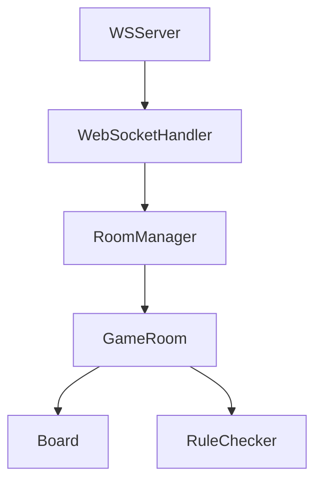

以下是完整的 WebSocket 服务器实现，包含服务启动、配置管理和生命周期控制：

```typescript
// src/websocket/WSServer.ts
import { WebSocketServer as WSS, WebSocketServerOptions } from "ws";
import { RoomManager } from "../rooms/RoomManager";
import { GameWebSocketHandler } from "./handlers";
import http from "http";
import { ServerMessage } from "../types/messages";
import dotenv from "dotenv";

dotenv.config(); // 加载环境变量

type ServerConfig = {
  port?: number;
  maxConnections?: number;
  pingInterval?: number;
};

export class WSServer {
  private wss?: WSS;
  private httpServer?: http.Server;
  private roomManager: RoomManager;
  private handler?: GameWebSocketHandler;
  private config: Required<ServerConfig>;

  constructor(config: ServerConfig = {}) {
    // 合并默认配置
    this.config = {
      port: parseInt(process.env.WS_PORT || "8080"),
      maxConnections: 1000,
      pingInterval: 30000,
      ...config,
    };

    // 初始化核心模块
    this.roomManager = new RoomManager();
  }

  async start(): Promise<void> {
    return new Promise((resolve) => {
      // 创建 HTTP 服务器用于健康检查
      this.httpServer = http.createServer((req, res) => {
        if (req.url === "/health") {
          res.writeHead(200, { "Content-Type": "application/json" });
          res.end(JSON.stringify({ status: "healthy" }));
          return;
        }
        res.writeHead(404);
        res.end();
      });

      // 创建 WebSocket Server
      const serverOptions: WebSocketServerOptions = {
        server: this.httpServer,
        clientTracking: true,
        perMessageDeflate: true,
        maxPayload: 1024 * 1024, // 1MB
      };

      this.wss = new WSS(serverOptions);

      // 初始化消息处理器
      this.handler = new GameWebSocketHandler(this.wss, this.roomManager);

      // 配置保活机制
      this.configureKeepAlive();

      // 启动服务器
      this.httpServer.listen(this.config.port, () => {
        console.log(`🚀 WebSocket server started on port ${this.config.port}`);
        resolve();
      });

      // 注册优雅关闭
      this.registerGracefulShutdown();
    });
  }

  private configureKeepAlive() {
    setInterval(() => {
      this.wss?.clients.forEach((ws) => {
        if (ws.isAlive === false) return ws.terminate();
        ws.isAlive = false;
        ws.ping();
      });
    }, this.config.pingInterval);

    this.wss?.on("connection", (ws) => {
      ws.isAlive = true;
      ws.on("pong", () => (ws.isAlive = true));
    });
  }

  private registerGracefulShutdown() {
    const signals: NodeJS.Signals[] = ["SIGINT", "SIGTERM"];

    signals.forEach((signal) => {
      process.on(signal, async () => {
        console.log(`\nReceived ${signal}, shutting down...`);

        // 关闭新连接
        this.wss?.close();

        // 断开已有连接
        this.wss?.clients.forEach((client) => {
          this.sendSystemMessage(client, "SERVER_SHUTDOWN", "服务器即将关闭");
          client.close(1001, "Server going down");
        });

        // 清理房间数据
        this.roomManager.cleanUpAllRooms();

        // 关闭HTTP服务器
        await new Promise<void>((resolve) =>
          this.httpServer?.close(() => resolve()),
        );

        console.log("Server shutdown complete");
        process.exit(0);
      });
    });
  }

  private sendSystemMessage(
    ws: WebSocket,
    code: string,
    message: string,
  ): void {
    if (ws.readyState !== ws.OPEN) return;

    ws.send(
      JSON.stringify({
        type: "system",
        code,
        message,
        timestamp: Date.now(),
      } as ServerMessage),
    );
  }

  // 获取服务器状态
  get serverStatus() {
    return {
      connections: this.wss?.clients.size || 0,
      rooms: this.roomManager.rooms.size,
      uptime: process.uptime(),
    };
  }
}
```

### 配置说明 (`.env` 示例)

```ini
# WebSocket 服务器配置
WS_PORT=3001
MAX_CONNECTIONS=1000
PING_INTERVAL_MS=30000
```

### 核心架构设计

1. **分层架构**：



2. **连接生命周期管理**：

```typescript
// 保持连接存活的机制
configureKeepAlive() {
  setInterval(() => {
    // 定期心跳检测
  }, 30_000);
}
```

3. **优雅停机流程**：

```typescript
process.on("SIGTERM", () => {
  // 1. 停止接受新连接
  // 2. 通知所有客户端
  // 3. 清理游戏数据
  // 4. 关闭服务
});
```

### 运行服务器示例

```typescript
// src/index.ts
import { WSServer } from "./websocket/WSServer";

// 配置服务器
const server = new WSServer({
  port: parseInt(process.env.WS_PORT || "8080"),
  maxConnections: 1000,
});

// 启动服务
server.start().catch(console.error);
```

### 功能扩展点

1. **认证中间件**:

```typescript
// 连接校验示例
serverOptions.verifyClient = (info, callback) => {
  const isValid = verifyToken(info.req.headers["authorization"]);
  callback(isValid);
};
```

2. **流量控制**:

```typescript
// 消息速率限制
ws.on(
  "message",
  throttle(
    (data) => {
      // 处理消息
    },
    { rate: 10 },
  ),
); // 每秒10条消息
```

3. **监控集成**:

```typescript
// Prometheus 指标示例
import client from "prom-client";
const activeConnections = new client.Gauge({
  name: "ws_active_connections",
  help: "Current active WebSocket connections",
});

setInterval(() => {
  activeConnections.set(server.serverStatus.connections);
}, 5000);
```

该实现可与之前的所有模块无缝集成，完成完整的五子棋对战服务端架构。建议通过 PM2 或者 Kubernetes 进行生产部署，结合这套代码最终可以支持：

- ➤ 分布式部署（需要添加 Redis 状态同步）
- ➤ 自动伸缩（基于连接数）
- ➤ 实时对战状态追踪
- ➤ 完整游戏生命周期管理
